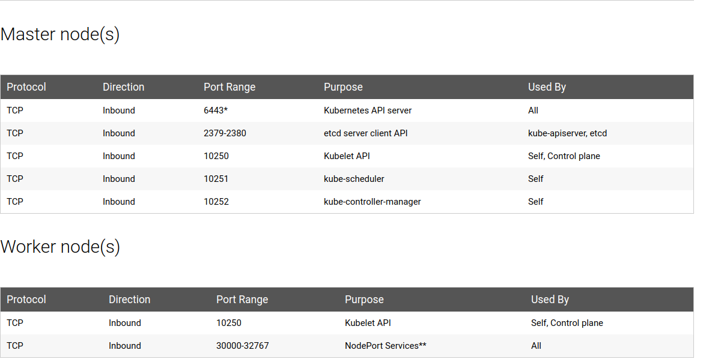

#### cka-ckad-prep-notes

Master and Worker nodes ports 

#### You can create the following resources using kubectl run with the --generator flag

| **Resource**  | **api group** | **kubectl command** |
| -------------                          | ------------- | ------- |
| Pod                                    | v1       | `kubectl run --generator=run-pod/v1` |
| Replication controller (deprecated)    | v1 | `kubectl run --generator=run/v1` |
| Deployment (deprecated) | apps/v1beta1 | `kubectl run --generator=deployment/apps.v1beta1` |
| Job (deprecated)                       | batch/v1 | `kubectl run --generator=job/v1` |
| CronJob (deprecated)                   | batch/v1beta1 | `kubectl run --generator=cronjob/v1beta1` |
| CronJob (deprecated)                   | batch/v2alpha1 | `kubectl run --generator=cronjob/v2alpha1` |

#### Configuration,Logs and Service details of Kubernetes,Docker

| Name                      | Comment                                                                   |
|-------------------------- | ---------------------------------------------------------------------------|
| Config folder             | `/etc/kubernetes/`                                                        |
| Manifests dif             | `/etc/kubernetes/manifests`                                               |
| Certificate files         | `/etc/kubernetes/pki/`                                                   |
| Credentials to API server | `/etc/kubernetes/kubelet.conf`                                            |
| Superuser credentials     | `/etc/kubernetes/admin.conf`                                             |
| kubectl config file       | `~/.kube/config`                                                         |
| Kubernets working dir     | `/var/lib/kubelet/`                                                      |
| Docker working dir        | `/var/lib/docker/`, `/var/log/containers/`                                |
| Etcd working dir          | `/var/lib/etcd/`                                                          |
| Network cni               | `/etc/cni/net.d/`                                                         |
| Log files                 | `/var/log/pods/`                                                          |
| Kubelet logs              | `/var/log/messages`, `/var/log/pods/kube-system_kube-proxy*/kube-proxy/*.log`|
| Kube-proxy                | `/var/log/pods/kube-system_kube-proxy*/kube-proxy/*.log`                  | 
| Kube-api-server           | `/var/log/pods/kube-system_kube-apiserver*/kube-proxy/*.log`              |
| Kube-controller           | `/var/log/pods/kube-system_kube-controller*/kube-proxy/*.log`             |
| Kube-scheduller           | `/var/log/pods/kube-system_kube-scheduler*/kube-scheduler/*.log`          |
| Env                       | `/etc/systemd/system/kubelet.service.d/10-kubeadm.conf`                   |
| Env                       | `export KUBECONFIG=/etc/kubernetes/admin.conf`                            |
| Audit logs                | `/var/log/audit/audit.log` | 

### Pod 
| NAME  | SHORTNAMES | APIGROUP | NAMESPACED | KIND | VERBS |
| ------------- | ------------- | ------- | -------- | --------- | -------- |
| `pods`  | `po`  | -  | `true` | `Pod` | `[create delete deletecollection get list patch update watch]` |

| Description | kubectl command |
| ------------- | ------------- |
| Create | `kubectl run nginx --generator=run-pod/v1 --image=nginx`|
| Create in particular namespace | `kubectl run nginx --generator=run-pod/v1 --image=nginx -n NAMEPSPACE` |
| Dry run,print object without creating it | `kubectl run POD_NAME --generator=run-pod/v1 --image=nginx --dry-run -o yaml` |
| Create from File | `kubectl create -f pod.yaml` |
| Create from File in particular namespace |  `kubectl create -f pod.yaml -n NAMEPSPACE` |
| List pods | `kubectl get po` or `kubectl get pod` or `kubectl get pods` |
| List pods in all namespaces | `kubectl get pods --all-namespaces` or `kubectl get pods -A` |
| List pods with more information | `kubectl get pods -owide` |
| List pods information in custom columns | `kubectl get pod POD_NAME -o custom-columns=CONTAINER:.spec.containers[0].name,IMAGE:.spec.containers[0].image` |
| Verbose Debug information/describe pod | `kubectl describe pod POD_NAME` |
| Logs | `kubectl logs POD_NAME` |
| Logs (multi-container case) | `kubectl logs POD_NAME -c CONTAINER_NAME` |
| Tail pod logs | `kubectl logs -f POD_NAME` | 
| Tail pods logs (multi-container case) | `kubectl logs -f POD_NAME -c CONTAINER_NAME` | 
| Delete pod | `kubectl delete pod POD_NAME` or `kubectl delete -f pod.yaml` or `kubectl delete pod/POD_NAME` |
| Delete pod in particular namespace | `kubectl delete pod POD_NAME -n NAMESPACE` |
| Get pod | `kubectl get pod POD_NAME` |
| Watch pod | `kubectl get pod POD_NAME --watch` |
| Patch pod | `kubectl patch pod valid-pod -p '{"spec":{"containers":[{"name":"kubernetes-serve-hostname"}]}}'` |
| Create and wrtie its spec to file | `kubectl run POD_NAME --image=nginx --restart=Never --dry-run -o yaml > pod.yaml`
| List pod in Json output format | `kubectl get pods -o json` |
| List pod in YAML output format | `kubectl get pods -o yaml` |
| Run command in existing pod | `kubectl exec POD_NAME -- ls /` |
| Run command in existing pod (multi-container case) | `kubectl exec POD_NAME -c CONTAINER_NAME -- ls /` |
| Exec to pod | `kubectl exec -it POD_NAME bash` |
| List Kubernetes critical pods | `kubectl get pods -n kube-system` |

### ReplicaSet 
| NAME  | SHORTNAMES | APIGROUP | NAMESPACED | KIND | VERBS |
| ------------- | ------------- | ------- | -------- | --------- | -------- |
| `replicasets`  | `rs`  | `apps`,`extensions` | `true` | `ReplicaSet` | `[create delete deletecollection get list patch update watch]` |

| Verb Description | kubectl command |
| ------------- | ------------- |
| create | `kubectl create -f replicaset.yaml`|
| List | `kubectl get rs` or `kubectl get replicaset` or `kubectl get replicasets` |
| List replicasets with more information | `kubectl get rs -owide`|
| List in all namespaces | `kubectl get rs --all-namespaces` or `kubectl get rs -A` |
| Delete | `kubectl delete rs REPLICASET_NAME` or `kubectl delete -f replicaset.yaml`|
| Get | `kubectl get rs REPLICASET_NAME` |

### Deployment,Scale & Rolling Upgrades
| NAME  | SHORTNAMES | APIGROUP | NAMESPACED | KIND | VERBS |
| ------------- | ------------- | ------- | -------- | --------- | -------- |
| `deployments`  | `deploy`  | `apps`,`extensions` | `true` | `Deployment` | `[create delete deletecollection get list patch update watch]` |

| Verb Description | kubectl command |
| ------------- | ------------- |
| Create Deployment | `kubectl create deployment DEPLOYMENT_NAME --image=busybox` |
| Run deployment with 2 replicas | `kubectl run POD_NAME --image=nginx --replicas=2 --port=80`|
| List deployments | `kubectl get deploy` or `kubectl get deployment` or `kubectl get deployments` |
| List deployments in all namespaces | `kubectl get deploy --all-namespaces` or `kubectl get deploy -A` |
| List deployments in particular namespace | `kubectl get deploy -n NAMESPACE` |
| List deployments with more information | `kubectl get deploy -owide`|
| Delete deployment | `kubectl delete deploy DEPLOYMENT_NAME` or `kubectl delete -f deployment.yaml`|
| Get particular deployment | `kubectl get deploy DEPLOYMENT_NAME` |
| Run deployment and expose it | `kubectl run DEPLOYMENT_NAME --image=nginx --port=80 --expose` |
| Update the nginx Pods to use the nginx:1.9.1 image instead of the nginx:1.7.9 image | `kubectl set image deployment/nginx-deployment nginx=nginx:1.9.1 --record` |
| Edit the Deployment | `kubectl edit deploy/DEPLOYMENT_NAME` |
| Deployment rollout status | `kubectl rollout status deploy/DEPLOYMENT_NAME` |
| Deployment rollout history | `kubectl rollout history deploy/DEPLOYMENT_NAME` |
| Rolling back deployment to previous version| `kubectl rollout undo deploy/DEPLOYMENT_NAME` |
| Scaling deployment  | `kubectl scale --replicas=2 deploy/DEPLOYMENT_NAME` |
| Pausing deployment | `kubectl rollout pause deploy/DEPLOYMENT_NAME` |
| Resuming deployment | `kubectl rollout resume deploy/DEPLOYMENT_NAME` |
| Verbose Debug information/describe deployment | `kubectl describe deploy/DEPLOYMENT_NAME` |
| Describe all deployments | `kubectl describe deployments` |
| Watch deployment | `kubectl get deploy/DEPLOYMENT_NAME --watch` |

### DaemonSet
| NAME  | SHORTNAMES | APIGROUP | NAMESPACED | KIND | VERBS |
| ------------- | ------------- | ------- | -------- | --------- | -------- |
| `daemonsets`  | `ds`  | `apps`,`extensions` | `true` | `DaemonSet` | `[create delete deletecollection get list patch update watch]` |

| Verb Description | kubectl command |
| ------------- | ------------- |
| create daemonset from file | `kubectl create -f daemonset.yaml`|
| List daemonsets | `kubectl get ds` or `kubectl get daemonset` or `kubectl get daemonset` |
| List daemonsets in all namespaces | `kubectl get ds --all-namespaces` or `kubectl get ds -A` |
| List daemonsets with more information | `kubectl get ds -owide`|
| Delete | `kubectl delete rs DAEMONSET_NAME` or `kubectl delete -f daemonset.yaml`|
| Get particular daemonset | `kubectl get ds DAEMONSET_NAME` |

### CronJob
| NAME  | SHORTNAMES | APIGROUP | NAMESPACED | KIND | VERBS |
| ------------- | ------------- | ------- | -------- | --------- | -------- |
| `cronjobs`  | `cj`  | `batch` | `true` | `CronJob` | `[create delete deletecollection get list patch update watch]`

### Job
| NAME  | SHORTNAMES | APIGROUP | NAMESPACED | KIND | VERBS |
| ------------- | ------------- | ------- | -------- | --------- | -------- |
| `jobs`  | `cj`  | `batch` | `true` | `Job` | `[create delete deletecollection get list patch update watch]` |

